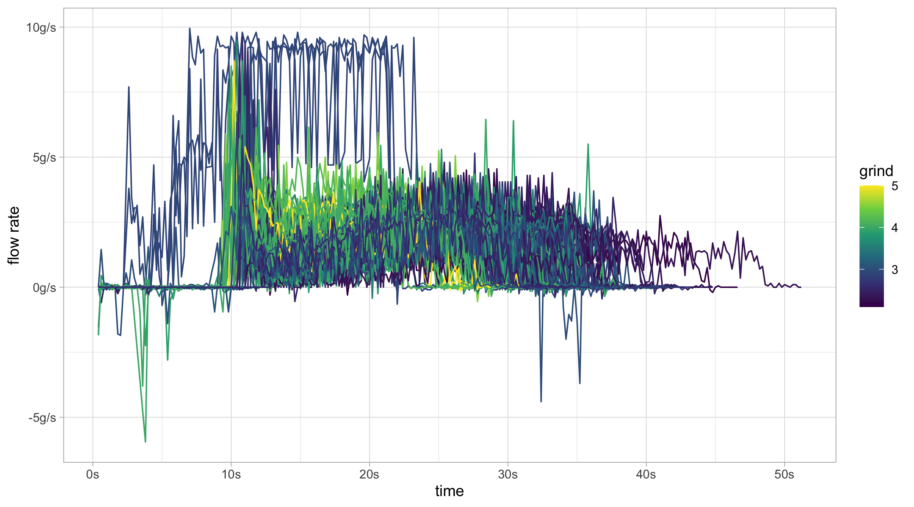

Coffee
================

<!-- This is created using README.Rmd, edit that file -->

This is a repo for analysing data from the Acaia Lunar scales.

## Data Collection

The data has the following fields;  
*id*, *name*, *createdAt*, *temperature*, *grind*, *tasty*, *note*,
*total time*, *average flowrate*, *total weight*, *brew data*.

There is some notable information missing, such as the dose, origin, or
the bean name.

### Including Extra Data

#### Using *name*

If you are consistent you can add information using the *name* field
e.g. **type, roastery, origin**

| name                          |
| :---------------------------- |
| Espresso, Full Circle, Brazil |
| Espresso, Full Circle, Brazil |
| Espresso, Full Circle, Brazil |
| Espresso, Full Circle, Brazil |
| Espresso, Full Circle, Brazil |

``` r
library(dplyr)
library(tidyr)
extra_data1 <- 
  raw_data %>% 
  # Separate out name
  separate(name, sep = ",", into = c("type", "roastery", "origin"))
```

#### Sample Separated Fields

| type     | roastery    | origin |
| :------- | :---------- | :----- |
| Espresso | Full Circle | Brazil |
| Espresso | Full Circle | Brazil |
| Espresso | Full Circle | Brazil |
| Espresso | Full Circle | Brazil |
| Espresso | Full Circle | Brazil |

### Using *note*

The JSON string can be included in the *note* field.

Firstly, to make it easier the app settings should be changed so that
the notes from the last brew are automatically populated for the next
brew.

**Settings \> Remember Notes**

Secondly, add a JSON string in the notes section  
e.g. \[{”batch\_name”:”Sao Joao”, ”roast\_date”:”2020-08-18”,
”variety”:”bourbon”, ”roast”:”medium”, ”dose”:18.2}\]

There is no limit to the extra fields added here, and you do not need to
be consistent in the fields added. If a field appears in certain brews
it will be NA for all others.

``` r
library(dplyr)
library(tidyr)

extra_data2 <- 
  extra_data1 %>%
  bind_cols(
    lapply(raw_data[["note"]], function(x) jsonlite::fromJSON(gsub("”|“", '"', x))) %>%
      bind_rows())
```

#### Sample Extra Fields

| batch\_name | roast\_date | variety | roast  |  dose | decaf |
| :---------- | :---------- | :------ | :----- | ----: | :---- |
| Sao Joao    | 2020-08-18  | bourbon | medium | 18.20 | NA    |
| Sao Joao    | 2020-08-18  | bourbon | medium | 18.10 | NA    |
| Sao Joao    | 2020-08-18  | bourbon | medium | 18.10 | NA    |
| Sao Joao    | 2020-08-18  | bourbon | medium | 18.05 | NA    |
| Sao Joao    | 2020-08-18  | bourbon | medium | 18.05 | NA    |

The data now has the following fields;  
*id*, *type*, *roastery*, *origin*, *createdAt*, *temperature*, *grind*,
*tasty*, *note*, *total time*, *average flowrate*, *total weight*, *brew
data*, *batch\_name*, *roast\_date*, *variety*, *roast*, *dose*,
*decaf*.

## Flow Rate Data

### Simpler

``` r
library(lubridate)
tidy_data <- 
  extra_data2 %>%
  # tidy decaf column (add FALSE where NA)
  mutate(decaf = case_when(is.na(decaf) ~ F, T ~ T)) %>%
  # tidy columns + calc age and ratio
  mutate(createdAt = as_date(createdAt), 
         roast_date = as_date(roast_date),
         age = createdAt - roast_date, ratio = `total weight`/dose) %>%
  # rename columns
  rename(total_time = `total time`, total_weight = `total weight`,
         mean_flow = `average flowrate`, brew_data = `brew data`)
```

``` r
flow_data <- 
  tidy_data$brew_data %>%
  # Split the data into a vector for each brew
  strsplit(split =  ";") %>%
  # Add names to each vector
  lapply(function(x){names(x) = paste0("t_", 1:length(x)); return(x)}) %>%
  # Combine all time series
  bind_rows() %>%
  # Add original data cols
  bind_cols(tidy_data)  %>%
  # reshape data to have weight and time in a single column
  pivot_longer(cols = starts_with("t_"),
               names_to = "time", values_to = "weight") %>%
  # parse time and calc times
  mutate(time = as.numeric(gsub("t_", "", time)) * 0.2,
         weight = as.numeric(weight),
         weight_diff = weight - lag(weight),
         flow = weight_diff / 0.2)
# Now it's ready to plot
```

#### Plots

``` r
library(ggplot2)
flow_data %>%
  # Remove decaf and large spikes in flow rate
  filter(!decaf, flow < 10, flow > -10) %>%
  ggplot(aes(x = time, y = flow, group = id, colour = grind)) +
  geom_line() +
  scale_color_continuous(type = "viridis") +
  scale_x_continuous(labels = function(x)paste0(x,"s")) +
  scale_y_continuous("flow rate", labels = function(x)paste0(x, "g/s"))
```



``` r
flow_data %>%
  filter(!decaf) %>%
  ggplot(aes(x = time, y = weight, group = id, colour = grind)) +
  geom_line() +
  scale_color_continuous(type = "viridis") +
  scale_x_continuous(labels = function(x)paste0(x,"s")) +
  scale_y_continuous("yield", labels = function(x)paste0(x, "g")) +
  ggtitle("Weight over Time")
```


### Advanced

Ideally large spikes at the very beginning should be removed, as should
the very end of the time series when the line is flat. Removing the flat
piece at the end of the curve would give a better ending time for the
shot.

``` r
my_brew_data_time <- 
  function(x, 
           split = ";", 
           pad_length = NULL, 
           beginning_time = 8, 
           beginning_tol = 0.5,
           stall_tol = 0.05,
           change_lag = 2){
    
    split_data <- as.numeric(unlist(strsplit(x, split =  split)))
    
    # Want to remove any spikes at the beginning of the pour
    beginning_vals <- 1:round(beginning_time/0.2)
    beginning_outliers <- which(abs(split_data[beginning_vals]) >= beginning_tol)
    if (length(beginning_outliers) > 0)
      split_data[beginning_vals][beginning_outliers] <- 0
    
    
    lag_n <- diff(split_data, lag = change_lag)
    first_flow <- min(which(lag_n > beginning_tol))
    
    lag_n_backwards <- diff(rev(split_data), lag = change_lag)
    last_flow <- min(which(lag_n_backwards < -stall_tol))
    last_flow <- length(split_data) - last_flow
    
    if (last_flow > first_flow) {
      split_data[last_flow:length(split_data)] <- NA
    }else{
      last_flow <- length(split_data)
    }

    if (!is.null(pad_length))
      split_data <- c(split_data, rep(NA, pad_length - length(split_data)))
    
    split_data <- c(split_data, first_flow, last_flow)

    names(split_data) <- c(paste("t",1:(length(split_data) - 2), sep = "_"),
                           "estimated_first_flow", "estimated_last_flow")
    return(split_data)
  }


my_brew_data_series <- function(.data, col_name, ...){
  col_name <- as_label(enquo(col_name))
  .data %>%
    bind_cols(
      lapply(.data[[col_name]], my_brew_data_time, ...) %>%
        bind_rows()
    ) %>%
    select(-col_name)
}
```

We can now use the `my_brew_data_series` to process the flow data. On
top of that the flow rate can be smoothed by calculating a rolling
average.

``` r
flow_data_adv <- 
  tidy_data  %>%
  my_brew_data_series(brew_data, 
                      stall_tol = 0.1,
                      change_lag = 2) %>%
  # reshape data to have weight and time in a single column
  pivot_longer(cols = starts_with("t_"),
               names_to = "time", values_to = "weight") %>%
  # parse time and calc times
  mutate(time = as.numeric(gsub("t_", "", time)) * 0.2,
         weight = as.numeric(weight),
         flow = (weight - lag(weight)) / 0.2,
         # Can calculate the beginning and end by multiplying by time frequency
         estimated_begin = estimated_first_flow * 0.2,
         estimated_end = estimated_last_flow * 0.2) %>%
  # Group by ID and calculate moving average
  group_by(id) %>%
  mutate(smooth_flow = zoo::rollapply(flow, 11, mean, fill = NA, na.rm = TRUE)) 
```

#### Plots

The smoothed flow rates give a much clearer graph compared to before.

``` r
flow_data_adv %>%
  filter(!decaf) %>%
  ggplot(aes(x = time, y = smooth_flow, group = id, colour = grind)) +
  geom_line() +
  scale_color_continuous(type = "viridis") +
  scale_x_continuous(labels = function(x)paste0(x,"s")) +
  scale_y_continuous("flow rate", labels = function(x)paste0(x, "g/s"))
```


``` r
flow_data_adv %>%
  filter(!decaf) %>%
  ggplot(aes(x = time, y = weight, group = id, colour = grind)) +
  geom_line() +
  scale_color_continuous(type = "viridis") +
  scale_x_continuous(labels = function(x)paste0(x,"s")) +
  scale_y_continuous("yield", labels = function(x)paste0(x, "g")) +
  ggtitle("Weight over Time")
```


